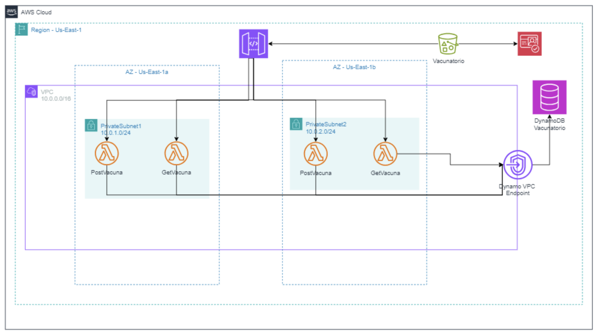

# AWS Cloud Architecture — Vaccine Management Project

## 📌 Project Overview
This project designs and implements a **serverless architecture on AWS** to manage vaccination records.  
The goal is to provide a scalable, secure, and highly available infrastructure to handle requests for storing and retrieving vaccination data.

---

## 🏗️ Architecture Components

### 🔹 VPC (Virtual Private Cloud)
- **CIDR Block:** 10.0.0.0/16  
- Provides an isolated network environment in AWS where all resources are deployed.  
- Ensures control over IP addressing, routing, and subnets.

---

### 🔹 Subnets
- **PrivateSubnet1 (10.0.1.0/24)** and **PrivateSubnet2 (10.0.2.0/24)** deployed across different Availability Zones (us-east-1a and us-east-1b).  
- Host AWS Lambda functions for redundancy and fault tolerance.  
- Improves resilience by distributing workloads.

---

### 🔹 AWS Lambda Functions
- **PostVacuna**: Receives and stores new vaccination records.  
- **GetVacuna**: Retrieves vaccination data upon request.  
- Serverless execution model allows auto-scaling depending on demand.  
- Placed inside private subnets for security.

---

### 🔹 API Gateway
- Acts as the **entry point** for external clients.  
- Manages REST API requests to trigger Lambda functions.  
- Provides authentication, request throttling, and monitoring.  

---

### 🔹 DynamoDB (Vaccination Records)
- **DynamoDB Table:** Stores vaccination records in a fully managed NoSQL database.  
- Scales horizontally and offers low-latency reads/writes.  
- Integrates with VPC endpoint for secure access without traversing the public internet.

---

### 🔹 S3 Bucket (Vacunatorio)
- Used to store complementary vaccination data, static content, or logs.  
- Provides durable and scalable storage with built-in versioning.

---

### 🔹 VPC Endpoint
- **Dynamo VPC Endpoint** allows private communication between Lambda functions and DynamoDB.  
- Avoids exposure of sensitive data to the public internet.  

---

## ⚙️ Key Benefits
- **Serverless design** reduces infrastructure management.  
- **Scalability**: Handles variable load automatically.  
- **High availability**: Uses multiple AZs to ensure resilience.  
- **Security**: Private subnets + VPC endpoints ensure data never leaves AWS internal network.  

---

## 🚀 How to Deploy
1. Provision resources with Terraform (`.tf` files included).  
2. Deploy Lambda functions (Python/Node.js code).  
3. Configure API Gateway endpoints.  
4. Test vaccination record insertion and retrieval.

---

## 🔒 Confidentiality Disclosure
This repository contains an **educational architecture design**.  
The structure and components are representative, but **no sensitive or production data** is included.
